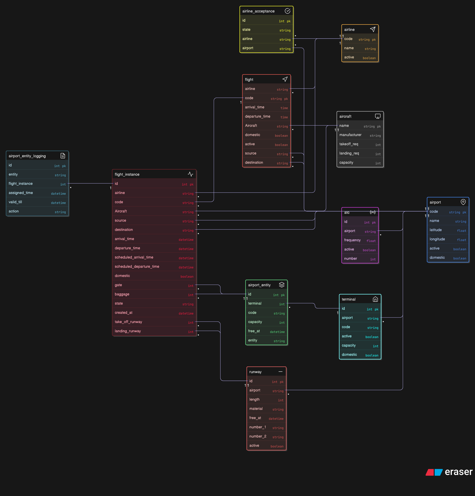

# 🛫 Airport Simulator

A simulation-based web application that models real-world airport and flight operations — flights, gates, scheduling, and delays — all tied together through clean backend design and a relational data model.



---

## ✈️ Overview

The **Airport Simulator** is a system that mimics how airports and flights function behind the scenes — from flight scheduling and gate allocation to handling delays and cascading effects.  

This project is a **simulation engine** that captures how dynamic real-world systems behave and interact over time.

---


## 🌟 Key Features

- 🧩 Realistic flight scheduling and gate assignment logic  
- ⏱️ Dynamic delay handling and reallocation of flights 
- 🧭 Data model built for flexibility and constraint integrity  
- 💾 Relational persistence modeled via SQLAlchemy ORM  
- 🔄 Optional real-time UI refresh through websockets and polling 
---

## 🧱 Architecture & Design

The design follows a clean separation between **simulation logic**, **data persistence**, and **presentation**.

### 📘 ER Diagram

The ER diagram above captures all major entities and relationships — Flights, Gates, Aircrafts, Passengers, Schedules, and Status mappings.  
Each relationship is designed for realistic constraints (for example, one gate cannot host two flights at overlapping times).

### 🧩 Core Components

| Component | Responsibility |


| **Flight Manager** | Handles flight lifecycle (creation, state transitions, delays). |

| **Gate Manager** | Allocates or reassigns gates dynamically to prevent conflicts. |

| **Scheduler / Simulation Engine** | Advances time and triggers events like arrival, boarding, and departure. |

| **Delay Propagation Engine** | Detects cascading effects when one flight is delayed. |

| **Frontend Layer** | Displays live data, allows interactions (trigger delay, reassign gate, etc.). |

---

## ⚙️ Tech Stack

| Layer | Tools / Frameworks |


| Language | **Python 3.10+** |

| Backend | **Flask / FastAPI** (modular service layer) |

| ORM | **Django ORM** |

| Database | **SQLite** (for local demo) / **PostgreSQL** (for production) |

| Frontend | **Streamlit** dashboard |

| Containerization | **Docker** |


---

## 🚀 Setup & Run

Follow these steps to set up and run locally:

```bash
# Clone the repo
git clone https://github.com/karthik12s/Airport-Simulator.git
cd Airport-Simulator

# (Optional) create a virtual environment
python3 -m venv venv
source venv/bin/activate

# Install dependencies
pip install -r requirements.txt

# Run locally
python app.py
```

Or run via Docker:

```bash
docker-compose up --build
```

Visit **http://localhost:5000** (or the port configured) to view the simulation dashboard.

---

## 🧠 Core Logic Highlights

Here’s what happens under the hood:

1. **Scheduler Engine**  
   Keeps track of time and triggers events like arrivals, departures, or boarding.

2. **Gate Allocation System**  
   Dynamically assigns available gates and reassigns when overlaps occur.

3. **Delay Propagation Logic**  
   If one flight is delayed, dependent flights and gate schedules adjust automatically.

4. **Real-Time Updates**  
   The backend pushes (or simulates) live updates to the Streamlit UI.


---

## 🔮 Future Enhancements

- Weather and air traffic effects and dynamic runway allocations using **AI**
- Visual map of globe with flight paths and their current status.


